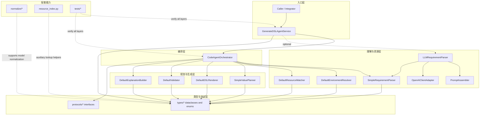
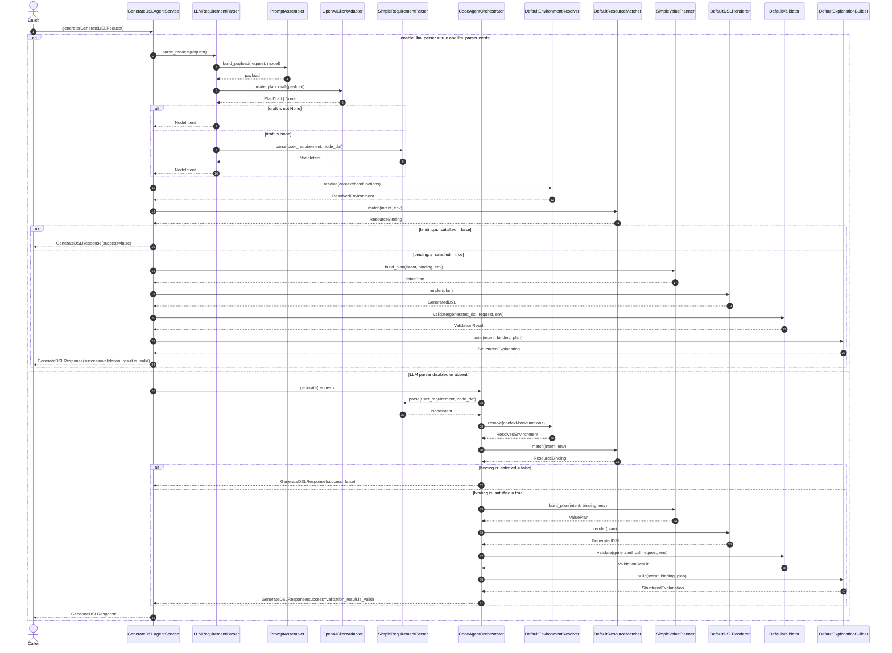
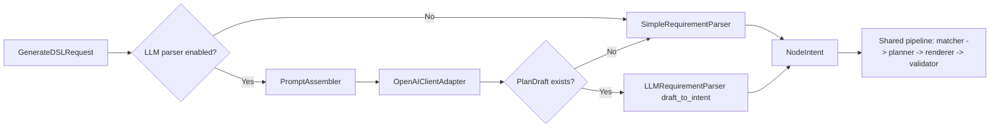

# Billing DSL Agent Architecture

本文档总结当前仓库中 coding agent 的主执行链路，覆盖从 `GenerateDSLRequest` 输入，到 `GenerateDSLResponse` 输出的完整对象流转。内容严格对应当前实现，不扩展未来可能接入的真实网络调用或额外运行时。

## 总览

当前 agent 有两层入口：

- `GenerateDSLAgentService`
  - 更外层入口。
  - 支持“优先走 LLM 需求理解，否则回退到本地规则解析”。
- `CodeAgentOrchestrator`
  - 纯本地主编排器。
  - 固定执行 `parse -> resolve -> match -> plan -> render -> validate -> explain`。

核心中间对象沿主链路依次传递：

`GenerateDSLRequest -> NodeIntent -> ResolvedEnvironment -> ResourceBinding -> ValuePlan -> GeneratedDSL -> ValidationResult -> GenerateDSLResponse`

## 模块分层图

这张图强调的是模块边界，而不是单次调用顺序：

- `GenerateDSLAgentService` 是最外层入口，负责决定是否启用 LLM 解析。
- `CodeAgentOrchestrator` 是核心编排器，负责串起后续各阶段。
- `services/*` 中的大多数实现都依赖 `types/*` 里的 dataclass 和 enum。
- `protocols/*` 提供的是编排依赖的抽象边界，便于替换实现。
- `normalize/*` 和 `resource_index.py` 属于配套能力，当前不是主链路必经步骤。
- `tests/*` 覆盖入口层和编排层，也验证若干阶段实现。

## 类关系图

```mermaid
classDiagram
    class GenerateDSLAgentService {
        +orchestrator: CodeAgentOrchestrator
        +llm_parser: LLMRequirementParser | None
        +enable_llm_parser: bool
        +generate(request) GenerateDSLResponse
    }

    class CodeAgentOrchestrator {
        +parser: RequirementParser
        +environment_resolver: EnvironmentResolver
        +resource_matcher: ResourceMatcher
        +value_planner: ValuePlanner
        +dsl_renderer: DSLRenderer
        +validator: Validator
        +explanation_builder: ExplanationBuilder
        +generate(request) GenerateDSLResponse
    }

    class LLMRequirementParser {
        +prompt_assembler: PromptAssembler
        +client: OpenAIClientAdapter
        +fallback_parser: SimpleRequirementParser
        +parse_request(request) NodeIntent
    }

    class PromptAssembler {
        +build_payload(request, model) dict
    }

    class OpenAIClientAdapter {
        <<protocol>>
        +create_plan_draft(payload) PlanDraft?
    }

    class SimpleRequirementParser {
        +parse(user_requirement, node_def) NodeIntent
    }

    class DefaultEnvironmentResolver {
        +resolve(...) ResolvedEnvironment
    }

    class DefaultResourceMatcher {
        +match(intent, env) ResourceBinding
    }

    class SimpleValuePlanner {
        +build_plan(intent, binding, env) ValuePlan
    }

    class DefaultDSLRenderer {
        +render(plan) GeneratedDSL
    }

    class DefaultValidator {
        +validate(generated_dsl, request, env) ValidationResult
    }

    class DefaultExplanationBuilder {
        +build(intent, binding, plan) StructuredExplanation
    }

    class GenerateDSLRequest
    class GenerateDSLResponse
    class NodeIntent
    class ResolvedEnvironment
    class ResourceBinding
    class ValuePlan
    class GeneratedDSL
    class ValidationResult
    class StructuredExplanation
    class PlanDraft

    GenerateDSLAgentService --> CodeAgentOrchestrator : delegates pipeline
    GenerateDSLAgentService --> LLMRequirementParser : optional requirement parsing
    GenerateDSLAgentService --> GenerateDSLRequest : input
    GenerateDSLAgentService --> GenerateDSLResponse : output

    LLMRequirementParser --> PromptAssembler : build payload
    LLMRequirementParser --> OpenAIClientAdapter : request draft
    LLMRequirementParser --> PlanDraft : consume
    LLMRequirementParser --> SimpleRequirementParser : fallback
    LLMRequirementParser --> NodeIntent : produce

    CodeAgentOrchestrator --> SimpleRequirementParser : parser implementation
    CodeAgentOrchestrator --> DefaultEnvironmentResolver : normalize environment
    CodeAgentOrchestrator --> DefaultResourceMatcher : bind resources
    CodeAgentOrchestrator --> SimpleValuePlanner : build plan
    CodeAgentOrchestrator --> DefaultDSLRenderer : render DSL
    CodeAgentOrchestrator --> DefaultValidator : validate
    CodeAgentOrchestrator --> DefaultExplanationBuilder : explain

    CodeAgentOrchestrator --> GenerateDSLRequest : consume
    CodeAgentOrchestrator --> NodeIntent : produce/consume
    CodeAgentOrchestrator --> ResolvedEnvironment : produce/consume
    CodeAgentOrchestrator --> ResourceBinding : produce/consume
    CodeAgentOrchestrator --> ValuePlan : produce/consume
    CodeAgentOrchestrator --> GeneratedDSL : produce/consume
    CodeAgentOrchestrator --> ValidationResult : produce
    CodeAgentOrchestrator --> StructuredExplanation : produce
    CodeAgentOrchestrator --> GenerateDSLResponse : assemble
```

## 主时序图

## 对象是怎么传递的

### 1. 输入元数据层

这一层对象由调用方直接提供，负责定义“要生成什么”和“可用什么资源”。

- `GenerateDSLRequest`
  - 主输入对象。
  - 包含 `user_requirement`、`node_def`、`global_context_vars`、`local_context_vars`、`available_bos`、`available_functions`。
- `NodeDef`
  - 描述目标节点本身，比如路径、名称、数据类型。
- 上下文、BO、函数定义
  - 作为环境资源池输入给 resolver 和 matcher。

这层对象只提供事实，不承担推理和规划职责。

### 2. 中间语义层

这一层把自然语言需求变成结构化意图，再把意图对齐到真实资源。

- `NodeIntent`
  - 由 parser 产出。
  - 表示“用户到底想让这个节点做什么”。
  - 里面最关键的是：
    - `source_types`
    - `operations`
    - `semantic_slots`
- `ResolvedEnvironment`
  - 由 environment resolver 产出。
  - 是 request 资源的规范化视图，完成去重、拷贝、归一化。
- `ResourceBinding`
  - 由 resource matcher 产出。
  - 表示意图中的语义槽位，最终匹配到了哪些具体资源。
  - 如果 `missing_resources` 非空，则 `is_satisfied` 为 `false`，主链路提前失败。

这层的作用是把“想做什么”变成“能拿什么来做”。

### 3. 执行规划层

这一层把已绑定资源的意图转成可渲染 DSL 的中间表达。

- `ValuePlan`
  - 由 value planner 产出。
  - 是最终 DSL 的中间计划对象。
  - 核心是 `final_expr`，它是 AST/IR 风格的 `ExprNode` 树。
- `ExprNode`
  - 表达式节点。
  - 可以表示上下文引用、函数调用、查询调用、字段访问、条件表达式等。
- `GeneratedDSL`
  - 由 renderer 从 `ValuePlan` 渲染得到。
  - 里面有 `methods` 和 `value_expression`。
  - `to_text()` 后变成真正的 `dsl_code` 文本。

这层完成的是“可执行表达”的构造，而不是最终校验和解释。

### 4. 输出结果层

这一层负责确认结果是否成立，并把所有中间产物打包返回。

- `ValidationResult`
  - 由 validator 产出。
  - 用来确认 DSL 至少满足当前实现中的基本完整性要求。
- `StructuredExplanation`
  - 由 explanation builder 产出。
  - 用于说明本次用了哪些 context、BO、function，以及最终表达式是否已规划。
- `GenerateDSLResponse`
  - 最终输出对象。
  - 同时携带：
    - `success`
    - `dsl_code`
    - `generated_dsl`
    - `intent`
    - `resolved_environment`
    - `resource_binding`
    - `value_plan`
    - `validation_result`
    - `explanation`
    - `failure_reason`

它不是只返回字符串，而是把整个推理链路的重要中间产物都保留下来，方便调试和解释。

## 可选 LLM 分支

### 作用边界

LLM 分支只替换“需求理解”这一步，不改变后半段主 pipeline。

- 被替换的阶段：
  - `user_requirement -> NodeIntent`
- 完全复用的阶段：
  - `ResolvedEnvironment`
  - `ResourceBinding`
  - `ValuePlan`
  - `GeneratedDSL`
  - `ValidationResult`
  - `GenerateDSLResponse`

### 小图

### LLM 分支的真实对象流

1. `PromptAssembler` 从 `GenerateDSLRequest` 里抽取节点信息和资源摘要，组装 `payload`。
2. `OpenAIClientAdapter` 接收 `payload`，返回 `PlanDraft` 或 `None`。
3. `LLMRequirementParser`
   - 如果拿到 `PlanDraft`，就把 `draft.source_types`、`draft.operations`、`draft.semantic_slots` 转成 `NodeIntent`。
   - 如果拿不到 `PlanDraft`，就 fallback 到 `SimpleRequirementParser.parse(...)`。
4. 一旦 `NodeIntent` 产出，后续与本地模式完全一致。

## 代码对应关系

这份图和说明对应以下实现：

- 编排主链路：[`billing_dsl_agent/services/orchestrator.py`](/D:/workspace/after_work/billing_dsl_agent/services/orchestrator.py)
- 外层入口与 LLM 分流：[`billing_dsl_agent/services/generate_dsl_agent_service.py`](/D:/workspace/after_work/billing_dsl_agent/services/generate_dsl_agent_service.py)
- LLM 需求理解：[`billing_dsl_agent/services/llm_requirement_parser.py`](/D:/workspace/after_work/billing_dsl_agent/services/llm_requirement_parser.py)
- 输入输出模型：[`billing_dsl_agent/types/request_response.py`](/D:/workspace/after_work/billing_dsl_agent/types/request_response.py)
- 语义对象：[`billing_dsl_agent/types/intent.py`](/D:/workspace/after_work/billing_dsl_agent/types/intent.py)
- 绑定对象：[`billing_dsl_agent/types/plan.py`](/D:/workspace/after_work/billing_dsl_agent/types/plan.py)
- 规划对象：[`billing_dsl_agent/types/dsl.py`](/D:/workspace/after_work/billing_dsl_agent/types/dsl.py)
