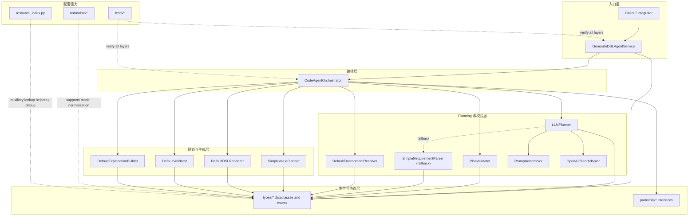
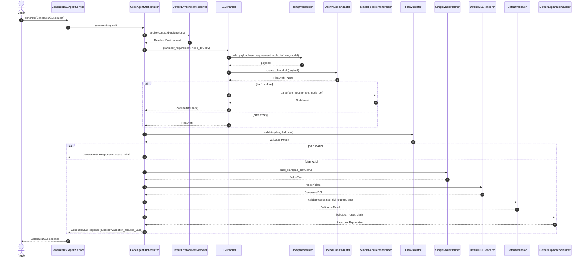
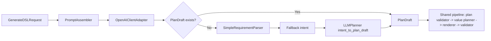

# Billing DSL Agent Architecture

本文档总结当前仓库中 coding agent 的主执行链路，覆盖从 `GenerateDSLRequest` 输入，到 `GenerateDSLResponse` 输出的完整对象流转。当前架构已经收缩为“LLM Planning + 本地校验”的 Agent 结构：LLM 负责提出资源使用方案，本地模块只负责校验、AST 落地、DSL 渲染和最终校验。

## 总览

当前 agent 有两层入口：

- `GenerateDSLAgentService`
  - 更外层入口。
  - 负责把请求委托给 orchestrator。
- `CodeAgentOrchestrator`
  - 核心编排器。
  - 固定执行 `resolve -> llm plan -> local plan validate -> ast plan -> render -> validate -> explain`。

核心中间对象沿主链路依次传递：

`GenerateDSLRequest -> ResolvedEnvironment -> PlanDraft -> ValidationResult(plan) -> ValuePlan -> GeneratedDSL -> ValidationResult(dsl) -> GenerateDSLResponse`

## 模块分层图

## 类关系图

```mermaid
classDiagram
    class GenerateDSLAgentService {
        +orchestrator: CodeAgentOrchestrator
        +generate(request) GenerateDSLResponse
    }

    class CodeAgentOrchestrator {
        +llm_planner: LLMPlanner
        +environment_resolver: EnvironmentResolver
        +plan_validator: PlanValidator
        +value_planner: ValuePlanner
        +dsl_renderer: DSLRenderer
        +validator: Validator
        +explanation_builder: ExplanationBuilder
        +generate(request) GenerateDSLResponse
    }

    class LLMPlanner {
        +prompt_assembler: PromptAssembler
        +client: OpenAIClientAdapter
        +fallback_parser: SimpleRequirementParser
        +plan(user_requirement, node_def, env) PlanDraft
    }

    class PromptAssembler {
        +build_payload(user_requirement, node_def, env, model) dict
    }

    class OpenAIClientAdapter {
        <<protocol>>
        +create_plan_draft(payload) PlanDraft?
    }

    class PlanValidator {
        +validate(plan, env) ValidationResult
    }

    class SimpleRequirementParser {
        +parse(user_requirement, node_def) NodeIntent
    }

    class DefaultEnvironmentResolver {
        +resolve(...) ResolvedEnvironment
    }

    class SimpleValuePlanner {
        +build_plan(plan_draft, env) ValuePlan
    }

    class DefaultDSLRenderer {
        +render(plan) GeneratedDSL
    }

    class DefaultValidator {
        +validate(generated_dsl, request, env) ValidationResult
    }

    class DefaultExplanationBuilder {
        +build(plan_draft, plan) StructuredExplanation
    }

    class GenerateDSLRequest
    class GenerateDSLResponse
    class PlanDraft
    class NodeIntent
    class ResolvedEnvironment
    class ValuePlan
    class GeneratedDSL
    class ValidationResult
    class StructuredExplanation

    GenerateDSLAgentService --> CodeAgentOrchestrator : delegates pipeline
    GenerateDSLAgentService --> GenerateDSLRequest : input
    GenerateDSLAgentService --> GenerateDSLResponse : output

    LLMPlanner --> PromptAssembler : build payload
    LLMPlanner --> OpenAIClientAdapter : request draft
    LLMPlanner --> PlanDraft : produce
    LLMPlanner --> SimpleRequirementParser : fallback
    LLMPlanner --> NodeIntent : derive debug intent

    CodeAgentOrchestrator --> LLMPlanner : create plan draft
    CodeAgentOrchestrator --> DefaultEnvironmentResolver : normalize environment
    CodeAgentOrchestrator --> PlanValidator : validate plan draft
    CodeAgentOrchestrator --> SimpleValuePlanner : build plan
    CodeAgentOrchestrator --> DefaultDSLRenderer : render DSL
    CodeAgentOrchestrator --> DefaultValidator : validate
    CodeAgentOrchestrator --> DefaultExplanationBuilder : explain

    CodeAgentOrchestrator --> GenerateDSLRequest : consume
    CodeAgentOrchestrator --> PlanDraft : produce/consume
    CodeAgentOrchestrator --> NodeIntent : produce/consume
    CodeAgentOrchestrator --> ResolvedEnvironment : produce/consume
    CodeAgentOrchestrator --> ValuePlan : produce/consume
    CodeAgentOrchestrator --> GeneratedDSL : produce/consume
    CodeAgentOrchestrator --> ValidationResult : produce
    CodeAgentOrchestrator --> StructuredExplanation : produce
    CodeAgentOrchestrator --> GenerateDSLResponse : assemble
```

## 主时序图

## 对象是怎么传递的

### 1. 输入元数据层

这一层对象由调用方直接提供，负责定义“要生成什么”和“可用什么资源”。

- `GenerateDSLRequest`
  - 主输入对象。
  - 包含 `user_requirement`、`node_def`、`global_context_vars`、`local_context_vars`、`available_bos`、`available_functions`。
- `NodeDef`
  - 描述目标节点本身，比如路径、名称、数据类型。
- 上下文、BO、函数定义
  - 作为环境资源池输入给 resolver。

### 2. Planning 层

这一层把自然语言需求变成结构化执行计划。

- `ResolvedEnvironment`
  - 由 environment resolver 产出。
  - 是 request 资源的规范化视图。
- `PlanDraft`
  - 由 `LLMPlanner` 产出。
  - 表示 LLM 提出的显式资源使用方案。
  - 核心字段是：
    - `context_refs`
    - `bo_refs`
    - `function_refs`
    - `semantic_slots`
    - `expression_pattern`

### 3. 本地校验与执行规划层

这一层先校验 LLM 计划，再把计划落成可渲染 DSL 的中间表达。

- `ValidationResult(plan)`
  - 由 `PlanValidator` 产出。
  - 校验 context path、BO、字段、函数、表达式形状是否存在且可落地。
- `ValuePlan`
  - 由 value planner 从 `PlanDraft` 产出。
  - 是最终 DSL 的中间计划对象。
  - 核心是 `final_expr`，它是 AST/IR 风格的 `ExprNode` 树。
- `GeneratedDSL`
  - 由 renderer 从 `ValuePlan` 渲染得到。
  - 里面有 `methods` 和 `value_expression`。
  - `to_text()` 后变成真正的 `dsl_code` 文本。

### 4. 输出结果层

这一层负责确认最终 DSL 是否成立，并把所有中间产物打包返回。

- `ValidationResult`
  - 由最终 DSL validator 产出。
  - 用来确认 DSL 至少满足当前实现中的基本完整性要求。
- `StructuredExplanation`
  - 由 explanation builder 产出。
  - 用于说明本次 plan 使用了哪些 context、BO、function，以及最终表达式是否已规划。
- `GenerateDSLResponse`
  - 最终输出对象。
  - 同时携带：
    - `success`
    - `dsl_code`
    - `plan_draft`
    - `generated_dsl`
    - `intent`
    - `resolved_environment`
    - `value_plan`
    - `validation_result`
    - `explanation`
    - `failure_reason`

## fallback 分支

### 作用边界

LLMPlanner 是默认入口；`SimpleRequirementParser` 只在拿不到结构化计划时作为 fallback 使用。

- fallback 只影响的阶段：
  - `user_requirement -> PlanDraft`
- 完全复用的阶段：
  - `ResolvedEnvironment`
  - `ValidationResult(plan)`
  - `ValuePlan`
  - `GeneratedDSL`
  - `ValidationResult`
  - `GenerateDSLResponse`

### 小图

### fallback 分支的真实对象流

1. `PromptAssembler` 从输入和 `ResolvedEnvironment` 里抽取节点信息和资源摘要，组装 `payload`。
2. `OpenAIClientAdapter` 接收 `payload`，返回 `PlanDraft` 或 `None`。
3. `LLMPlanner`
   - 如果拿到 `PlanDraft`，主链路直接继续。
   - 如果拿不到 `PlanDraft`，就 fallback 到 `SimpleRequirementParser.parse(...)`，再把结果转换成 `PlanDraft`。
4. 一旦 `PlanDraft` 产出，后续主链路完全一致。

## 代码对应关系

- 编排主链路：[`billing_dsl_agent/services/orchestrator.py`](/D:/workspace/after_work/billing_dsl_agent/services/orchestrator.py)
- 外层入口：[`billing_dsl_agent/services/generate_dsl_agent_service.py`](/D:/workspace/after_work/billing_dsl_agent/services/generate_dsl_agent_service.py)
- LLM planning：[`billing_dsl_agent/services/llm_planner.py`](/D:/workspace/after_work/billing_dsl_agent/services/llm_planner.py)
- 本地 plan 校验：[`billing_dsl_agent/services/plan_validator.py`](/D:/workspace/after_work/billing_dsl_agent/services/plan_validator.py)
- 输入输出模型：[`billing_dsl_agent/types/request_response.py`](/D:/workspace/after_work/billing_dsl_agent/types/request_response.py)
- 计划对象：[`billing_dsl_agent/types/agent.py`](/D:/workspace/after_work/billing_dsl_agent/types/agent.py)
- 环境对象：[`billing_dsl_agent/types/plan.py`](/D:/workspace/after_work/billing_dsl_agent/types/plan.py)
- 规划对象：[`billing_dsl_agent/types/dsl.py`](/D:/workspace/after_work/billing_dsl_agent/types/dsl.py)
