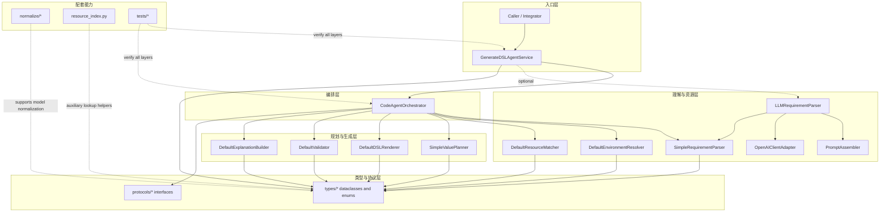

# after-work

这个仓库当前的核心内容是一个 Billing DSL generation agent。它接收用户需求、节点定义和可用资源，输出 DSL 代码以及整条推理链路中的关键中间对象。

## 架构入口

- 架构详解文档：[`AGENT_ARCHITECTURE.md`](/D:/workspace/after_work/AGENT_ARCHITECTURE.md)
- 包导出入口：[`billing_dsl_agent/__init__.py`](/D:/workspace/after_work/billing_dsl_agent/__init__.py)
- 外层 agent service：[`billing_dsl_agent/services/generate_dsl_agent_service.py`](/D:/workspace/after_work/billing_dsl_agent/services/generate_dsl_agent_service.py)
- 核心 orchestrator：[`billing_dsl_agent/services/orchestrator.py`](/D:/workspace/after_work/billing_dsl_agent/services/orchestrator.py)

## 模块分层图

## 主对象流

主链路围绕以下对象展开：

`GenerateDSLRequest -> NodeIntent -> ResolvedEnvironment -> ResourceBinding -> ValuePlan -> GeneratedDSL -> ValidationResult -> GenerateDSLResponse`

其中：

- `GenerateDSLAgentService` 决定是否先走 LLM 需求理解。
- `CodeAgentOrchestrator` 负责执行主 pipeline。
- 后半段生成链路固定为 `resolve -> match -> plan -> render -> validate -> explain`。

更详细的类关系图、时序图和 LLM 分支说明见 [`AGENT_ARCHITECTURE.md`](/D:/workspace/after_work/AGENT_ARCHITECTURE.md)。
