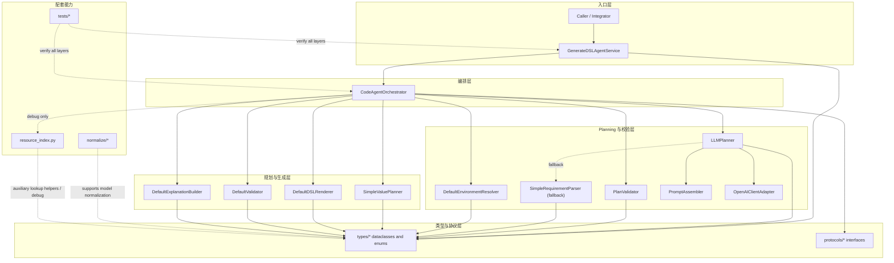

# after-work

这个仓库当前的核心内容是一个 Billing DSL generation agent。当前主链路已经收缩为“LLM Planning + 本地校验 + DSL 落地”结构：LLM 负责提出资源使用方案，本地系统负责验证方案、生成 AST、渲染 DSL 并做最终校验。

## 架构入口

- 架构详解文档：[`AGENT_ARCHITECTURE.md`](/D:/workspace/after_work/AGENT_ARCHITECTURE.md)
- 包导出入口：[`billing_dsl_agent/__init__.py`](/D:/workspace/after_work/billing_dsl_agent/__init__.py)
- 外层 agent service：[`billing_dsl_agent/services/generate_dsl_agent_service.py`](/D:/workspace/after_work/billing_dsl_agent/services/generate_dsl_agent_service.py)
- 核心 orchestrator：[`billing_dsl_agent/services/orchestrator.py`](/D:/workspace/after_work/billing_dsl_agent/services/orchestrator.py)

## 模块分层图

## 主对象流

主链路围绕以下对象展开：

`GenerateDSLRequest -> ResolvedEnvironment -> PlanDraft -> ValidationResult(plan) -> ValuePlan -> GeneratedDSL -> ValidationResult(dsl) -> GenerateDSLResponse`

其中：

- `LLMPlanner` 生成结构化 `PlanDraft`。
- `PlanValidator` 校验显式资源引用，而不是用本地规则猜资源。
- `SimpleRequirementParser` 只保留为 fallback。
- 后半段生成链路固定为 `plan validate -> value plan -> render -> validate -> explain`。

更详细的类关系图、时序图和 fallback 分支说明见 [`AGENT_ARCHITECTURE.md`](/D:/workspace/after_work/AGENT_ARCHITECTURE.md)。
